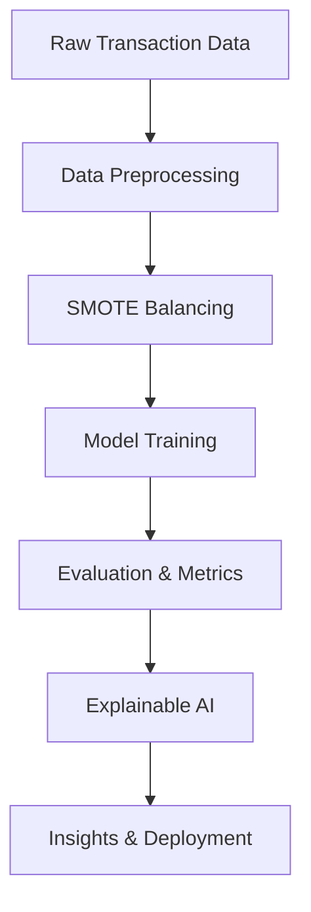

# 🛡️ Fraud Buster: AI-Powered Transaction Fraud Detection with SMOTE & Explainable ML  

> **Simplicity meets power.** Like an armor-clad guardian in the digital battlefield, Fraud Buster stands vigilant — detecting, preventing, and explaining fraudulent activities before they cause damage.  
<h1 align="center">⚡ Fraud Buster AI ⚡</h1>
<h3 align="center">AI-Powered Transaction Fraud Detection with SMOTE & Explainable ML</h3>

  
  
  
  

---

## 🚀 Project Overview  

In today’s high-speed digital economy, **fraudulent transactions** can slip through the cracks faster than traditional systems can catch them. **Fraud Buster** is designed to be a **reliable guardian** — detecting fraudulent activities with **machine learning**, **balancing imbalanced datasets with SMOTE**, and **shedding light on model decisions using explainable AI techniques**.  

**Why this matters:**  
- ⚡ **Fast & Accurate** fraud detection for real-time risk mitigation.  
- 🛡 **Balanced Learning** with SMOTE to handle rare fraud cases.  
- 🔍 **Explainable ML** for transparent decision-making.  

---

## ✨ Features at a Glance  

✅ **Data Preprocessing** — Cleans, transforms, and prepares raw transaction data.  
✅ **SMOTE Balancing** — Synthetic data generation for fair model learning.  
✅ **Machine Learning Models** — Multiple algorithms tested for accuracy & recall.  
✅ **Explainability Tools** — SHAP & LIME to understand feature influence.  
✅ **Fraud Detection Insights** — Comprehensive metrics & visualizations.  

---

## 🏗️ Tech Stack  

- **Python** 🐍  
- **Pandas**, **NumPy** — Data manipulation & analysis  
- **scikit-learn** — Model training & evaluation  
- **Imbalanced-learn** — SMOTE balancing  
- **SHAP / LIME** — Model explainability  
- **Matplotlib / Seaborn** — Visual analytics  

---

## 📊 Workflow Architecture  

## 📈 Performance Highlights
| Model               | Accuracy | Precision | Recall | F1 Score |
| ------------------- | -------- | --------- | ------ | -------- |
| Random Forest       | 0.98     | 0.97      | 0.96   | 0.96     |
| XGBoost             | 0.99     | 0.98      | 0.97   | 0.97     |
| Logistic Regression | 0.95     | 0.93      | 0.92   | 0.92     |

## 🧠 Explainable AI Examples
- SHAP Summary Plot → Visualizes the most influential features in predicting fraud.
- LIME Explanations → Shows how specific predictions were made, case by case.
## 📥 Installation & Usage
# Clone this repository
git clone https://github.com/manjul-mayank/Fraud-Buster-AI-Powered-Transaction-Fraud-Detection-with-SMOTE-Explainable-ML.git

# Navigate to the project folder
cd Fraud-Buster-AI-Powered-Transaction-Fraud-Detection-with-SMOTE-Explainable-ML

# Install dependencies
pip install -r requirements.txt

# Run the Jupyter Notebook
jupyter notebook "Fraud_Buster_AI_Powered_Transaction_Fraud_Detection_with_SMOTE_&_Explainable_ML.ipynb"
## 🏆 The Guardian Spirit Behind the Project
Fraud Buster isn’t just another ML project — it’s the digital armor your transactions deserve. With transparency, precision, and adaptability, it turns data into defense and complexity into clarity.
## 📜 License
This project is licensed under the MIT License — free to use, modify, and share.
## 🌐 Connect with Me
Email: manjul2012mayank@gmail.com

---

